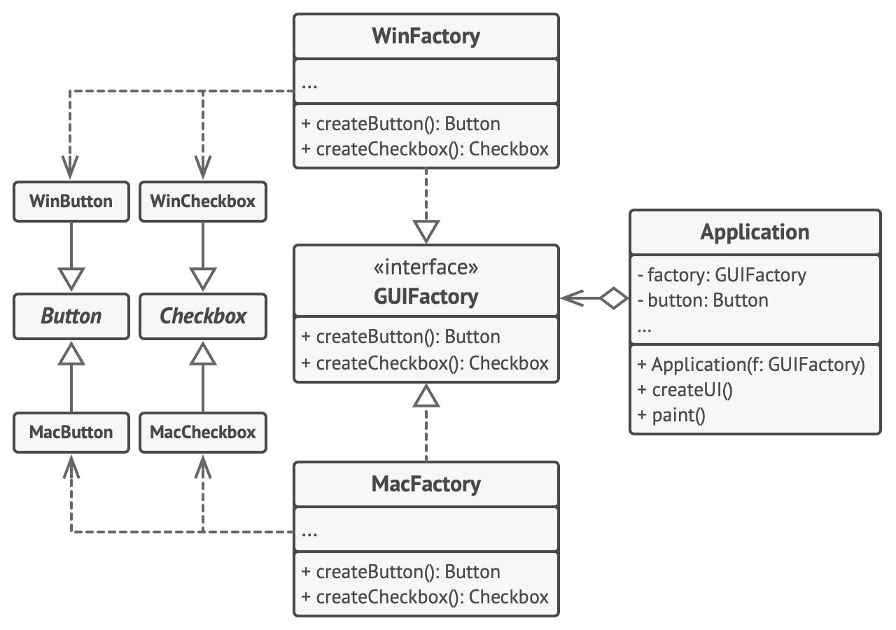

# Exercice 6: Refactoring de factory abstraite

Dans cet exercice, nous souhaitons faire une refactoring d'une librairie de création d'éléments graphiques (button, checkbox) pour les plateformes Windows et MacOS.

On s'attend à ce que les mêmes éléments d'interface utilisateur dans une application multiplateforme se comportent de la même manière, mais semblent un peu différents sous différents systèmes d'exploitation. De plus, c'est notre travail de nous assurer que les éléments de l'interface utilisateur correspondent au style du système d'exploitation actuel. Nous ne voudrions pas que votre programme affiche les commandes macOS lorsqu'il est exécuté sous Windows.

L'interface `GUIFactory` déclare un ensemble de méthodes de création que le code client peut utiliser pour produire différents types d'éléments d'interface utilisateur. Les usines concrètes (`WinFactory`, `MacFactory`) correspondent à des systèmes d'exploitation spécifiques et créent les éléments d'interface utilisateur qui correspondent à ce système d'exploitation particulier.

Cela fonctionne comme ceci: lorsqu'une application se lance, elle vérifie le type du système d'exploitation actuel. L'application utilise ces informations pour créer un objet d'usine à partir d'une classe qui correspond au système d'exploitation. Le reste du code utilise cette fabrique pour créer des éléments d'interface utilisateur. Cela empêche la création de mauvais éléments.

Voici une modélisation de notre programme:




```java
// The abstract factory interface declares a set of methods that
// return different abstract products. These products are called
// a family and are related by a high-level theme or concept.
// Products of one family are usually able to collaborate among
// themselves. A family of products may have several variants,
// but the products of one variant are incompatible with the
// products of another variant.
interface GUIFactory {
  Button createButton()
  Checkbox createCheckbox()
}


// Concrete factories produce a family of products that belong
// to a single variant. The factory guarantees that the
// resulting products are compatible. Signatures of the concrete
// factory's methods return an abstract product, while inside
// the method a concrete product is instantiated.
class WinFactory implements GUIFactory {
  public Button createButton() {
    return new WinButton();
  }

  public Checkbox createCheckbox() {
    return new WinCheckbox();
  }
}

// Each concrete factory has a corresponding product variant.
class MacFactory implements GUIFactory {
  public Button createButton() {
    return new MacButton();
  }
  public Checkbox createCheckbox() {
    return new MacCheckbox();
  }
}


// Each distinct product of a product family should have a base
// interface. All variants of the product must implement this
// interface.
interface Button {
  void paint()
}

// Concrete products are created by corresponding concrete factories.
class WinButton implements Button {
  // Render a button in Windows style.
  public void paint() {
    System.out.println("painting WinButton");
  }
}

class MacButton implements Button {
  // Render a button in macOS style.
  public void paint() {
    System.out.println("painting MacButton");
  }
}

// Here's the base interface of another product. All products
// can interact with each other, but proper interaction is
// possible only between products of the same concrete variant.
interface Checkbox {
  void paint()
}

class WinCheckbox implements Checkbox {
  // Render a checkbox in Windows style.
  public void paint() {
    System.out.println("painting WinCheckbox");
  }
}

class MacCheckbox implements Checkbox {
  // Render a checkbox in macOS style.
  public void paint() {
    System.out.println("painting MacCheckbox");
  }
}
```


## Question 1:

Proposez une définition alternative de `GUIFactory` appellée `GUIModule` en utilisant des types `Button` et `Checkbox` abstraits et encapsulés dans `GUIModule`.


## Question 2:

Donnez une implémentation de `GUIModule` pour Windows.


## Question 3:

Donnez une implémentation de `GUIModule` pour MacOS.


## Question 4:

Créez une méthode pour obtenir un module à partir d'un type d'OS passé en paramètre.


## Question 5:

Dans le `Main`, exécuter le code suivant:

```scala
val module = GUIModule.create(OS.Windows)
val button = module.createButton()
val checkbox = module.createCheckbox()
button.paint()
checkbox.paint()
```
